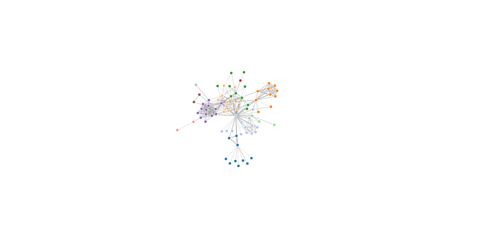

# d3-creed

Force layout chart based on [d3.js](http://d3js.org/).

### Install

```sh
$ npm install d3-creed
```

### Usage

```javascript
const creed = require('d3-creed')

// create chart
var chart = creed({
    target: '#chart'
})

chart.render({
    nodes: [...],
    links: [...]
})
```

or in browser:

```html
<script src="path/to/d3-creed.min.js"></script>
<script>
    var chart = creed({
        target: '#chart'
    });
    chart.render({
        nodes: [...],
        links: [...]
    });
</script>
```

### Examples

```sh
$ npm run example
```

then access [http://localhost:9000/examples/](http://localhost:9000/examples/).

Basic Example:



Customized Example:


### API

#### creed(options)

Create a new force layout chart with given options.

#### chart.render(data)

Render the chart with given data.

#### chart.clear()

Clear the chart.

### Customization

You could customize every step when rendering the chart.

- customize force

    ```javascript
    chart.force
      .charge(-100)
      .linkDistance(50)
    ```

- customize links rendering

    ```javascript
    chart._renderLinks = function() {
      // ...
    }
    ```

- customize nodes rendering

    ```javascript
    chart._renderNodes = function() {
      // ...
    }
    ```

- customize links ticking

    ```javascript
    chart._tickLinks = function() {
      // ...
    }
    ```

- customize nodes ticking

    ```javascript
    chart._tickNodes = function() {
      // ...
    }
    ```

- customize events

  ```javascript
  // these could be accessed before rendering
  chart.svg
  chart.defs
  chart.glink
  chart.gnode

  // these could be accessed after rendering
  chart.nodes
  chart.links
  ```

### License

[MIT](./LICENSE)
